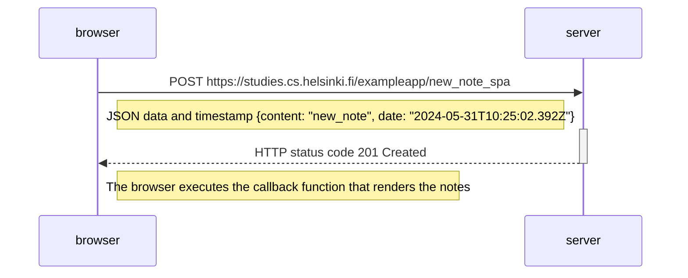

```mermaid
sequenceDiagram
    participant browser
    participant server

    browser->>server: POST https://studies.cs.helsinki.fi/exampleapp/new_note_spa

    Note right of browser: JSON data and timestamp  {content: "new_note", date: "2024-05-31T10:25:02.392Z"}

    activate server
    server-->>browser: HTTP status code 201 Created 
    deactivate server

    Note right of browser: The browser executes the callback function that renders the notes
```
